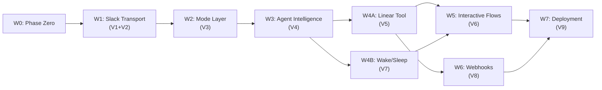

# NanoClaw Implementation Plan

> Pipeline: `20260221-nanoclaw-hub`
> Date: 2026-02-22
> Shape: A (Fork ZeroClaw + Extend Slack)

**Goal:** Build a conversational PM bot in Slack that drives Linear work management, running locally via Ollama (Qwen 3 14B) on an M4 Mac, deployed as a Docker Compose stack.

**Architecture:** Fork ZeroClaw (394k LOC Rust platform), add ~1,100 LOC: Socket Mode WebSocket for Slack, Linear Tool via raw GraphQL, Mode layer mapping personas to ZeroClaw Agent instances. New code isolated in `src/modes/`, `src/tools/linear.rs`, `src/wake_sleep.rs`, with bounded modifications to 3 existing files (`slack.rs`, `traits.rs`, `schema.rs`).

**Tech Stack:** Rust (ZeroClaw fork), tokio-tungstenite (Socket Mode WebSocket), reqwest (Linear GraphQL — already in ZeroClaw), Ollama (Qwen 3 14B via ZeroClaw's native provider), Docker Compose, Cloudflare Tunnel.

**Repo:** `cmbays/zeroclaw` (forked from `zeroclaw-labs/zeroclaw`). Wave 0 creates this repo; Waves 1-7 execute inside it.

---

## Dependency Graph



## Wave Summary

| Wave | Name | Slices | Sessions | Serial | Demo |
|------|------|--------|----------|--------|------|
| 0 | Phase Zero | — | 1 | Yes | Repo exists, `cargo build` passes, Docker skeleton builds |
| 1 | Slack Transport | V1+V2 | 1 | Yes | Bot connects via WebSocket, echoes with custom identity |
| 2 | Mode Layer | V3 | 1 | Yes | `@zeroclaw [pm]` → bot responds with PM persona |
| 3 | Agent Intelligence | V4 | 1 | Yes | Ask question → Ollama reasons → conversational response |
| 4 | Tools & Gating | V5+V7 | 2 | No | A: Linear issue CRUD. B: Wake/sleep engine |
| 5 | Interactive Flows | V6 | 1 | Yes | Draft → Confirm button → issue filed in Linear |
| 6 | Webhooks & Lifecycle | V8 | 1 | Yes | Linear project → `#prj-slug` channel auto-created |
| 7 | Deployment | V9 | 1 | Yes | `docker compose up` → full system operational |

---

## Fork Surface Tracker

### Files Modified (from ZeroClaw upstream)

| File | Wave(s) | Change | Merge Risk |
|------|---------|--------|------------|
| `Cargo.toml` | W0, W1 | Feature flags, add `tokio-tungstenite` | Low (additive) |
| `src/channels/slack.rs` | W1, W4B, W5 | Socket Mode rewrite, filter, BK handlers | Medium (clean replacement) |
| `src/channels/traits.rs` | W1 | Add fields to `SendMessage` struct | Low (additive, optional fields) |
| `src/config/schema.rs` | W2 | Add `[modes]` section | Low (additive, new section) |
| `src/tools/mod.rs` | W4A | Register LinearTool (~3 lines) | Low (additive) |
| `src/main.rs` | W1, W6 | Startup wiring for modes + webhooks | Low (additive) |

### Files Created (NanoClaw-specific)

| File | Wave | Purpose | ~LOC |
|------|------|---------|------|
| `src/modes/mod.rs` | W2 | ModeRegistry, ModeConfig | 60 |
| `src/modes/thread_state.rs` | W2 | ThreadModeState, per-thread Agent store | 40 |
| `src/modes/response_policy.rs` | W3 | ResponsePolicySection (PromptSection impl) | 20 |
| `src/tools/linear.rs` | W4A | LinearTool (Tool trait impl, GraphQL) | 400 |
| `src/wake_sleep.rs` | W4B | WakeSleepEngine, timers, should_respond | 150 |
| `src/tools/slack_ops.rs` | W6 | Channel lifecycle operations | 80 |
| `src/webhook.rs` | W6 | HTTP webhook endpoint | 70 |
| `modes/pm/identity.json` | W2 | PM mode AIEOS persona definition | 50 |
| `modes/pm/skills/` | W2 | PM mode skill manifests | 30 |
| `docker-compose.yml` | W0, W7 | Deployment config | 40 |
| `Dockerfile` | W0, W7 | Multi-stage Rust build | 30 |
| `CLAUDE.md` | W0 | Project instructions for Claude sessions | 100 |

### Cargo Dependencies Added

| Crate | Wave | Purpose |
|-------|------|---------|
| `tokio-tungstenite` | W1 | Socket Mode WebSocket |
| (reqwest already exists) | — | Linear GraphQL (no new dep needed) |

---

## Wave 0: Phase Zero (Repo Setup)

> **Context:** Starts in `print-4ink`, creates and transitions to `~/Github/zeroclaw`
> **Serial:** Yes (single session)

### Task 0.1: Fork ZeroClaw Repo

1. Fork `zeroclaw-labs/zeroclaw` → `cmbays/zeroclaw` via `gh repo fork` (default name, no `--fork-name`)
2. Clone to `~/Github/zeroclaw`
3. Configure remotes: `origin` = `cmbays/zeroclaw`, `upstream` = `zeroclaw-labs/zeroclaw`
4. Create `dev` branch: `git checkout -b dev`
5. Verify: `cargo build` succeeds, `cargo test` passes (ZeroClaw's 3,214 tests)

### Task 0.2: Strip Unused Cargo Features

**File:** `Cargo.toml`

1. Review feature flags — identify what NanoClaw needs vs doesn't
2. Keep: `channel-slack`, `provider-ollama`, `identity`, tool infrastructure
3. Strip: Discord, Telegram, Matrix, Lark, WhatsApp, hardware, firmware, web UI, RAG-PDF
4. Create NanoClaw default feature set (or use `--no-default-features --features nanoclaw`)
5. Verify: `cargo build` with stripped features, `cargo test` passes for kept features

### Task 0.3: Copy Planning Artifacts

1. Create `docs/planning/` in zeroclaw repo
2. Copy from `~/Github/print-4ink/docs/workspace/20260221-nanoclaw-hub/`:

| Source | Destination |
|--------|-------------|
| `frame.md` | `docs/planning/frame.md` |
| `shaping.md` | `docs/planning/shaping.md` |
| `breadboard.md` | `docs/planning/breadboard.md` |
| `spike-a5-mode-layer.md` | `docs/planning/spike-a5-mode-layer.md` |
| `spike-zeroclaw-validation.md` | `docs/planning/spike-zeroclaw-validation.md` |
| `requirements-handoff.md` | `docs/planning/requirements-handoff.md` |
| `impl-plan.md` | `docs/planning/impl-plan.md` |

3. Synthesize `docs/planning/DECISIONS.md` from `memory/nanoclaw-hub.md` content (standalone, no print-4ink dependency)

### Task 0.4: Create CLAUDE.md

**File:** `CLAUDE.md` (zeroclaw repo root)

Sections:
- Project overview: NanoClaw = ZeroClaw fork, Slack PM bot, Ollama LLM
- Commands: `cargo build`, `cargo test`, `cargo run`, `docker compose up`
- Architecture: ZeroClaw trait system (Tool, Channel, Provider), NanoClaw additions
- Fork rules: which files we modify, feature flag isolation, upstream sync strategy
- Code locations: `src/modes/`, `src/tools/linear.rs`, modified `src/channels/slack.rs`
- Planning docs: link to `docs/planning/`
- Session startup: work on `dev` branch (no worktree system yet)

### Task 0.5: Create Claude Project Memory

**File:** `~/.claude/projects/-Users-cmbays-Github-zeroclaw/memory/MEMORY.md`

Seed with:
- What NanoClaw is, ZeroClaw relationship
- Shape A selected, fork surface (3 files, 0.3%)
- Tech stack: Rust, Ollama Qwen 3 14B, Linear GraphQL, Socket Mode
- Critical decisions (from pipeline stages 1-6)
- Wave progress tracker (all pending)

### Task 0.6: Verify Clean Build

1. `cargo build` with NanoClaw feature flags
2. `cargo test` — ZeroClaw tests pass after stripping
3. Commit on `dev` branch: docs + CLAUDE.md + Cargo.toml changes + Docker skeleton

### Task 0.7: Docker Compose Skeleton

**Files:** `docker-compose.yml`, `Dockerfile`

Three services (stubs):
- `zeroclaw`: Multi-stage Rust build (`rust:latest` builder → minimal runtime), runs compiled binary
- `ollama`: `ollama/ollama` image, volume mount for models
- `tunnel`: `cloudflare/cloudflared` image, placeholder tunnel config

Verify: `docker compose build` succeeds

### Wave 0 Exit Criteria

- [ ] `cmbays/zeroclaw` repo exists on GitHub
- [ ] `cargo build` and `cargo test` pass with NanoClaw features
- [ ] `docs/planning/` contains all 8 artifacts + DECISIONS.md
- [ ] `CLAUDE.md` exists and is comprehensive
- [ ] Claude project memory seeded at `~/.claude/projects/-Users-cmbays-Github-zeroclaw/`
- [ ] `docker-compose.yml` skeleton builds
- [ ] Initial commit on `dev` branch

---

## Wave 1: Slack Transport (V1 + V2)

> **Repo:** `~/Github/zeroclaw` (dev branch)
> **Depends on:** Wave 0
> **Demo:** "Bot connects via WebSocket, receives a message, echoes back with custom identity"

### Session: `socket-mode-transport`

**Breadboard affordances:** N1, N2 (stub), N3, N4 (extended), N24, N25, S6, U3, U7

**Modified files:**
- `src/channels/slack.rs` — Replace `listen()` HTTP polling with Socket Mode WebSocket; extend `send()`
- `src/channels/traits.rs` — Add fields to `SendMessage`
- `Cargo.toml` — Add `tokio-tungstenite`

**Steps:**
1. Read `src/channels/slack.rs` — understand existing HTTP polling (`conversations.history` at 3s interval)
2. Read `src/channels/traits.rs` — understand `SendMessage` struct
3. Add `tokio-tungstenite` to `Cargo.toml`
4. Rewrite `listen()`:
   - Call `apps.connections.open` with app-level token to get WebSocket URL
   - Connect via `tokio-tungstenite`
   - Parse Socket Mode envelopes (type, payload, envelope_id)
   - Acknowledge each envelope immediately (Socket Mode requirement)
   - Extract event payload and forward to channel
5. Extend `SendMessage` struct in `traits.rs`:
   - `username: Option<String>`
   - `icon_emoji: Option<String>`
   - `reply_broadcast: Option<bool>`
   - `blocks: Option<serde_json::Value>` (Block Kit JSON)
6. Extend `send()` in `slack.rs` to include new fields when present
7. Implement stub `filter_event()` — pass everything through (real logic in W4B)
8. Implement basic `route_event()` — extract text, channel, thread_ts
9. Wire `startup()` to use Socket Mode config (app_token from `[channels.slack]`)

**Testing:**
- Unit: Socket Mode envelope parsing (various event types)
- Unit: `send()` payload construction with identity fields
- Unit: `send()` payload with Block Kit blocks

**Exit:** Bot connects to Slack via WebSocket, echoes messages with custom username + icon_emoji.

---

## Wave 2: Mode Layer (V3)

> **Repo:** `~/Github/zeroclaw` (dev branch)
> **Depends on:** Wave 1
> **Demo:** "Type `@zeroclaw [pm]`, bot responds with PM persona identity"

### Session: `mode-layer`

**Breadboard affordances:** N5, N6, N7, N8, N9, S1, S2, U1

**Read first:**
- `docs/planning/spike-a5-mode-layer.md` — concrete mapping of modes → ZeroClaw primitives
- `src/config/schema.rs` — existing config patterns (esp. `agents: HashMap`)
- `src/agent/agent.rs` — AgentBuilder pattern
- `src/identity.rs` — AIEOS v1.1 system
- `src/skills/mod.rs` — Skill loading from TOML/MD manifests

**New files:**
- `src/modes/mod.rs` — ModeConfig, ModeRegistry
- `src/modes/thread_state.rs` — ThreadModeState
- `modes/pm/identity.json` — PM persona (AIEOS format)
- `modes/pm/skills/` — PM skill manifests

**Modified files:**
- `src/config/schema.rs` — Add `[modes]` section

**Steps:**
1. Add `[modes]` to config schema, mirroring existing `[agents]` HashMap pattern:
   ```toml
   [modes.pm]
   identity_format = "aieos"
   aieos_path = "modes/pm/identity.json"
   skills_dir = "modes/pm/skills"
   visual_identity = { username = "ZeroClaw PM", icon_emoji = ":clipboard:" }
   response_policy = "respond when work items discussed, stay silent for social chat"
   tools = ["linear_create_issue", "linear_list_issues", "linear_update_issue"]
   ```
2. Implement `ModeRegistry::from_config()` — reads Config (S6), builds mode definitions (S1)
3. Implement `ModeRegistry::build_agent()` — creates Agent via AgentBuilder with mode-specific AIEOS identity, skills, tools, prompt sections
4. Implement `parse_mode_activation()` — extracts mode name from `@zeroclaw [pm]` syntax
5. Implement `ThreadModeState::get_or_create()` — returns existing Agent or creates new via ModeRegistry
6. Implement `get_visual_identity()` — returns username + icon_emoji for the active mode
7. Wire `route_event()` (from W1): message → parse mode → get/create Agent → visual identity → send
8. Create PM mode AIEOS identity JSON (name, bio, psychology, linguistics)

**Testing:**
- Unit: `parse_mode_activation()` with `@zeroclaw [pm]`, `@zeroclaw pm`, edge cases
- Unit: `ModeRegistry::from_config()` with test TOML
- Unit: `ThreadModeState` get_or_create and cleanup

**Exit:** `@zeroclaw [pm]` → bot echoes back with "ZeroClaw PM" username and :clipboard: icon.

---

## Wave 3: Agent Intelligence (V4)

> **Repo:** `~/Github/zeroclaw` (dev branch)
> **Depends on:** Wave 2
> **Demo:** "Ask a question, bot reasons via Ollama and responds conversationally"

### Session: `agent-ollama`

**Breadboard affordances:** N10, N11, N12, N20, N21, U4

**Read first:**
- `src/agent/agent.rs` — Agent::process_message() flow
- `src/agent/prompt.rs` — SystemPromptBuilder, PromptSection trait
- `src/providers/ollama.rs` — OllamaProvider (chat_with_tools, capabilities)

**New files:**
- `src/modes/response_policy.rs` — ResponsePolicySection (PromptSection impl)

**Steps:**
1. Implement `ResponsePolicySection`:
   ```rust
   pub struct ResponsePolicySection { policy: String }
   impl PromptSection for ResponsePolicySection {
       fn name(&self) -> &str { "Response Policy" }
       fn build(&self, _ctx: &PromptContext) -> Option<String> {
           Some(format!("## Response Policy\n\n{}", self.policy))
       }
   }
   ```
2. Wire mode Agent's SystemPromptBuilder to include ResponsePolicySection (via `add_section()`)
3. Configure Ollama provider for Qwen 3 14B:
   - Model: `qwen3:14b` (or appropriate Ollama tag)
   - Endpoint: `http://localhost:11434` (local dev) / `http://ollama:11434` (Docker)
4. Wire full pipeline: route_event → mode Agent → process_message → Ollama → compose response → send with visual identity
5. Handle errors: Ollama timeout, model not loaded, malformed response → U14 (user-friendly error)

**Testing:**
- Unit: ResponsePolicySection build output
- Integration: Agent::process_message() with mocked Ollama responses
- Manual: End-to-end with real Ollama + Qwen 3 14B

**Exit:** Ask "what's our auth initiative status?" → Ollama reasons → PM-flavored conversational response.

---

## Wave 4: Tools & Gating (V5 + V7)

> **Repo:** `~/Github/zeroclaw` (dev branch)
> **Depends on:** Wave 3
> **Parallel:** Sessions A and B can run simultaneously (different files, no conflicts). Use feature branches if running in parallel, or run sequentially on `dev` branch.

### Session A: `linear-tool` (V5)

**Demo:** "Ask bot to create an issue, it calls Linear API and returns the link"

**Breadboard affordances:** N13, N14, N15, N16, S4, U13

**New files:**
- `src/tools/linear.rs` (~400 LOC)

**Modified files:**
- `src/tools/mod.rs` — Register LinearTool in `all_tools_with_runtime()`
- `src/config/schema.rs` — Add `[tools.linear]` config (api_key, team_id)

**Read first:**
- `src/tools/traits.rs` — Tool trait interface
- `examples/custom_tool.rs` — Registration pattern
- `src/tools/mod.rs` — `all_tools_with_runtime()` function

**Steps:**
1. Implement `LinearTool` (Tool trait):
   - `name()` → `"linear"`
   - `description()` → Linear issue management
   - `parameters_schema()` → JSON Schema for operations
   - `execute()` → dispatch to operation handlers
2. Implement GraphQL operations:
   - `create_issue` (title, description, template, labels, assignee)
   - `list_issues` (by project, status, assignee)
   - `update_issue` (status, labels, assignee, description)
   - `get_initiative` (fetch with child issues)
   - `list_templates` (available issue templates)
3. Implement `build_graphql_query()` — construct query from operation + args
4. Implement `parse_graphql_response()` — extract structured data from Linear response
5. Add `[tools.linear]` config: api_key, team_id, default_project
6. Register in `all_tools_with_runtime()`

**Testing:**
- Unit: GraphQL query construction for each operation
- Unit: Response parsing with mock JSON
- Integration: Real Linear API call (requires OAuth token)

### Session B: `wake-sleep` (V7)

**Demo:** "Bot sleeps after 1hr inactivity, wakes on @mention"

**Breadboard affordances:** N2, N17, N18, N19, S3, U2, U8

**New files:**
- `src/wake_sleep.rs` (~150 LOC)

**Modified files:**
- `src/channels/slack.rs` — Replace `filter_event()` stub with real wake/sleep logic

**Steps:**
1. Implement `WakeSleepEngine`:
   - `HashMap<ThreadId, WakeState>` — `Awake { last_activity }` or `Sleeping`
   - `on_event()` — @mention → wake, active thread → reset timer, sleeping → discard
   - `should_respond()` — discretionary logic for non-tagged messages
2. Implement `inactivity_timer`:
   - Per-thread `tokio::time::sleep` (~1 hour, configurable)
   - On expiry: transition to Sleeping, send sleep notification via N4
   - On activity: cancel and restart timer
3. Replace `filter_event()` stub in `slack.rs`:
   - @mention → always forward (and wake if sleeping)
   - Active thread message → forward, reset timer
   - Sleeping thread non-mention → discard
4. Send sleep notification: "Going to sleep — @mention me to wake up" (U8)

**Testing:**
- Unit: WakeState transitions (Sleeping ↔ Awake)
- Unit: `should_respond()` with various event types
- Unit: Timer reset logic (mocked tokio time)

---

## Wave 5: Interactive Flows (V6)

> **Repo:** `~/Github/zeroclaw` (dev branch)
> **Depends on:** Wave 4 (both sessions)
> **Demo:** "Bot drafts issue with buttons → click Confirm → issue filed in Linear"

### Session: `confirm-edit-cancel`

**Breadboard affordances:** N26, N27, N28, U5, U9, U10, U11, U12, U13

**Modified files:**
- `src/channels/slack.rs` — Add `handle_block_action()`, `handle_view_submission()`, `open_modal()`

**Steps:**
1. Implement `handle_block_action()` (N26):
   - Parse block_action payload (action_id, value, thread context)
   - Route to Agent::process_message() — agent decides next action
2. Implement `open_modal()` (N27):
   - Construct Block Kit modal view JSON (title, description, template, labels, assignee)
   - Call Slack `views.open` API
3. Implement `handle_view_submission()` (N28):
   - Parse view submission payload
   - Route to Agent::process_message()
4. Design Block Kit JSON templates:
   - Issue draft message with Confirm / Edit / Cancel buttons
   - Issue preview modal with editable fields
   - Issue confirmation message with Linear link
5. Wire `route_event()` to dispatch: `block_action` → `handle_block_action`, `view_submission` → `handle_view_submission`

**Testing:**
- Unit: Block Kit JSON template construction
- Unit: Action payload parsing (confirm, edit, cancel)
- Integration: Full confirm flow end-to-end

**Exit:** Draft issue → click Confirm → issue created in Linear → confirmation message with link.

---

## Wave 6: Webhooks & Lifecycle (V8)

> **Repo:** `~/Github/zeroclaw` (dev branch)
> **Depends on:** Wave 4A (Linear tool)
> **Demo:** "Create Linear project → bot auto-creates `#prj-slug` channel"

### Session: `webhooks-lifecycle`

**Breadboard affordances:** N29, N22, N23, U17

**New files:**
- `src/webhook.rs` — HTTP endpoint for inbound webhooks
- `src/tools/slack_ops.rs` — Channel lifecycle operations

**Modified files:**
- `src/main.rs` — Add webhook listener to startup

**Steps:**
1. Implement `receive_webhook()` (N29):
   - HTTP POST endpoint (use whatever HTTP server ZeroClaw already has, or add `axum`/`warp`)
   - Parse Linear webhook payloads (project.create, issue.update)
   - Parse GitHub webhook payloads (pull_request.closed with merged=true)
   - Verify webhook signatures
   - Dispatch to appropriate handler
2. Implement `detect_channel_project_link()` (N22):
   - Parse Slack channel description for Linear project URL
   - Parse Linear project description for Slack channel link
   - Fallback: `#prj-` prefix convention
3. Implement `create_project_channel()` (N23):
   - Call Slack `conversations.create` for `#prj-<slug>`
   - Set channel description with bidirectional Linear link
   - Post creation notification (U17)
4. Wire `startup()` to start webhook listener alongside Socket Mode
5. Configure Cloudflare Tunnel routing in `docker-compose.yml`

**Testing:**
- Unit: Linear webhook payload parsing
- Unit: GitHub webhook payload parsing
- Unit: Channel slug generation from project names

**Exit:** Create "Auth Refactor" project in Linear → webhook fires → `#prj-auth-refactor` channel created.

---

## Wave 7: Deployment (V9)

> **Repo:** `~/Github/zeroclaw` (dev branch)
> **Depends on:** Waves 5 and 6
> **Demo:** "`docker compose up` → bot connects, Ollama serves model, tunnel routes webhooks"

### Session: `docker-deployment`

**Breadboard affordances:** N25 (containerized), U14

**Modified files:**
- `docker-compose.yml` — Finalize from Wave 0 skeleton
- `Dockerfile` — Finalize multi-stage build

**New files:**
- `scripts/ollama-setup.sh` — Model pull + health check
- `config/zeroclaw.toml` — Production config template
- `.env.example` — Secrets template

**Steps:**
1. Finalize Dockerfile:
   - Stage 1: `rust:latest` builder, `cargo build --release` with NanoClaw features only
   - Stage 2: Minimal runtime (debian-slim), copy binary + config + modes/
2. Finalize docker-compose.yml:
   - `zeroclaw`: from Dockerfile, depends_on ollama, reads config + `.env`
   - `ollama`: `ollama/ollama`, volume for models, GPU passthrough config
   - `tunnel`: `cloudflare/cloudflared`, tunnel token from env
   - Shared network, health checks, restart policies
3. Create `scripts/ollama-setup.sh`: pull Qwen 3 14B, verify loaded
4. Create production config template + `.env.example`
5. Graceful error handling:
   - Ollama unavailable → retry with backoff, user-friendly message (U14)
   - Slack disconnect → auto-reconnect (Socket Mode handles this)
   - Linear API errors → user-friendly message (U14)

**Testing:**
- `docker compose build` succeeds
- `docker compose up` — all services start, health checks pass
- End-to-end: message → response through full containerized stack

**Exit:** `docker compose up` launches NanoClaw connected to Slack, Ollama serving Qwen 3 14B, tunnel routing webhooks.

---

## Session Cross-Reference

| Session Topic | Wave | Slice | Key New/Modified Files | Depends On |
|---|---|---|---|---|
| `phase-zero` | W0 | — | Cargo.toml, CLAUDE.md, docker-compose.yml | — |
| `socket-mode-transport` | W1 | V1+V2 | slack.rs, traits.rs | phase-zero |
| `mode-layer` | W2 | V3 | modes/mod.rs, modes/thread_state.rs, schema.rs | socket-mode-transport |
| `agent-ollama` | W3 | V4 | modes/response_policy.rs | mode-layer |
| `linear-tool` | W4A | V5 | tools/linear.rs | agent-ollama |
| `wake-sleep` | W4B | V7 | wake_sleep.rs, slack.rs (filter) | agent-ollama |
| `confirm-edit-cancel` | W5 | V6 | slack.rs (BK handlers) | linear-tool, wake-sleep |
| `webhooks-lifecycle` | W6 | V8 | webhook.rs, tools/slack_ops.rs | linear-tool |
| `docker-deployment` | W7 | V9 | docker-compose.yml, Dockerfile | confirm-edit-cancel, webhooks-lifecycle |

---

## Notes

### Manifest Adaptation

The execution manifest (`manifest.yaml`) follows the print-4ink pipeline format but NanoClaw is a separate repo. The `work build` orchestrator won't work directly — sessions run manually in `~/Github/zeroclaw`. The manifest is retained as machine-readable documentation and can be adapted for a nanoclaw-specific orchestrator later.

### Branch Strategy

**Upstream mirror model:**
- `main` = upstream mirror (fast-forward only from `upstream/main`, never commit here)
- `dev` = fork's integration branch (PRs merge here, this is "our main")
- Feature branches from `dev` for each wave session, PR back into `dev`

Wave 0 creates `dev` from `main`. Waves 1-7 create feature branches from `dev`, PR into `dev`. Wave 4's parallel sessions use separate feature branches.

### Upstream Sync Strategy

Periodic upstream sync:
1. `git fetch upstream`
2. `git checkout main && git merge --ff-only upstream/main`
3. `git checkout dev && git merge main`
4. Resolve conflicts (expect slack.rs conflicts — our Socket Mode replaces their polling)
5. `cargo test` to verify

Feature flags isolate fork changes, so most upstream changes merge cleanly.
